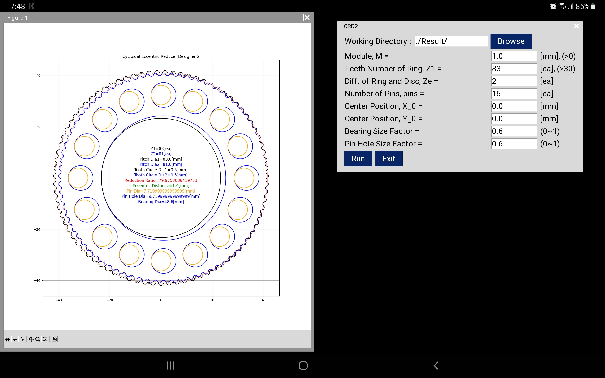
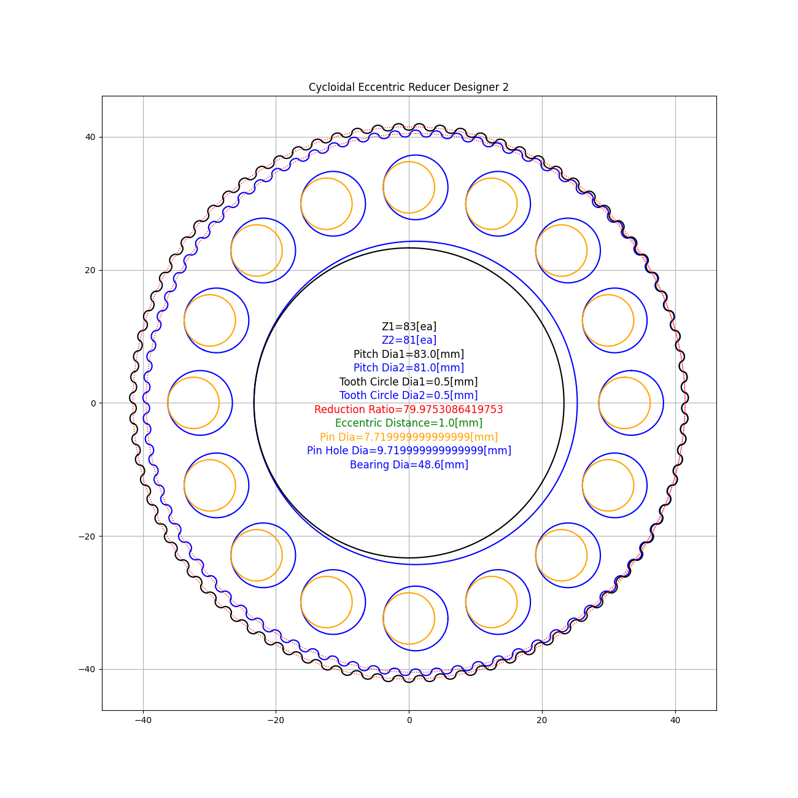
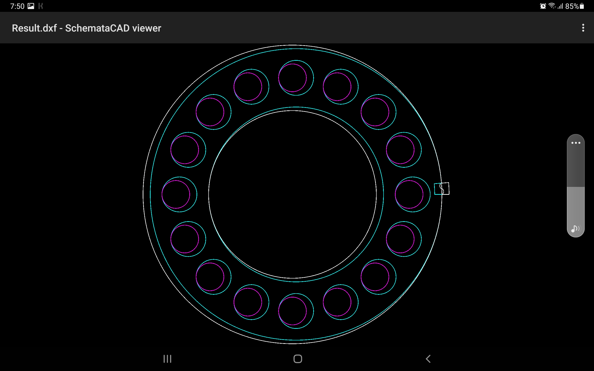

# CRD2

_Cycloidal Eccentric Reducer Designer 2 - with Python3_


## Using on PC

* Install python3 and git
* Install some libraries :

```
pip install numpy
pip install matplotlib
pip install ezdxf
pip install pysimplegui
```
* Clone this repository by git
* Run :

```
python CRD2.py
```

## Build exe in MS Windows 10

* Development version of pyinstaller is needed because of matplotlib matching issue.

```
pip install https://github.com/pyinstaller/pyinstaller/archive/develop.zip
pyinstaller --icon=CRD2.ico -w -F CRD2.py
```

## Using on Android Device by Pydroid3

* Install [Pydroid3](https://play.google.com/store/apps/details?id=ru.iiec.pydroid3&hl=ko&gl=US) in PlayStore
* Install some libraries by Pip menu in Pydroid3 (numpy, matplotlib, ezdxf, pysimplegui)
* Install [mgit](https://play.google.com/store/apps/details?id=com.manichord.mgit&hl=ko&gl=US) in PlayStore
* Clone this repository
* Load CRD2.py and run



* Save plotting image like that path :

```
/storage/emulated/0/Pictures/DCIM/Screenshots/Figure_1.png
```



* Check dxf file :




## Using on Linux

* **Anaconda3** has Tk font problem.
* In **pyenv** Environment

```bash
pyenv install 3.11.3
pyenv global 3.11.3

pip install numpy
pip install matplotlib
pip install ezdxf
pip install pysimplegui

python CRD2.py
```


## Input parameters

* __M__ : Module (Similar to Involute gear design system)
* __Z1__ : Teeth number of Ring gear
* __Ze__ : Teeth difference between Ring and Disc
* __pins__ : Number of pins
* __X0,Y0__ : Center position


## Thank you!